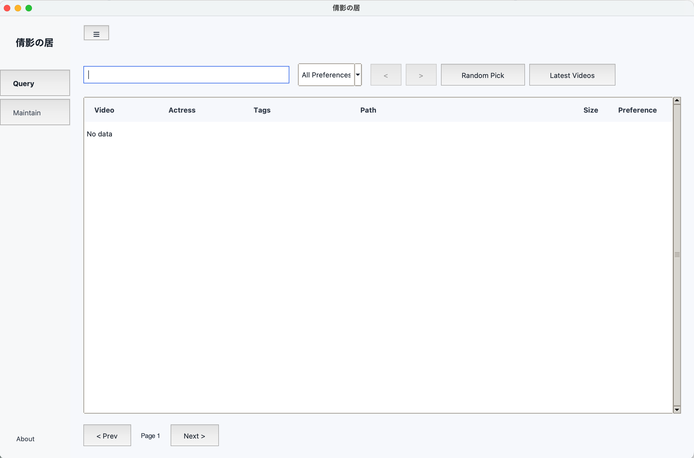
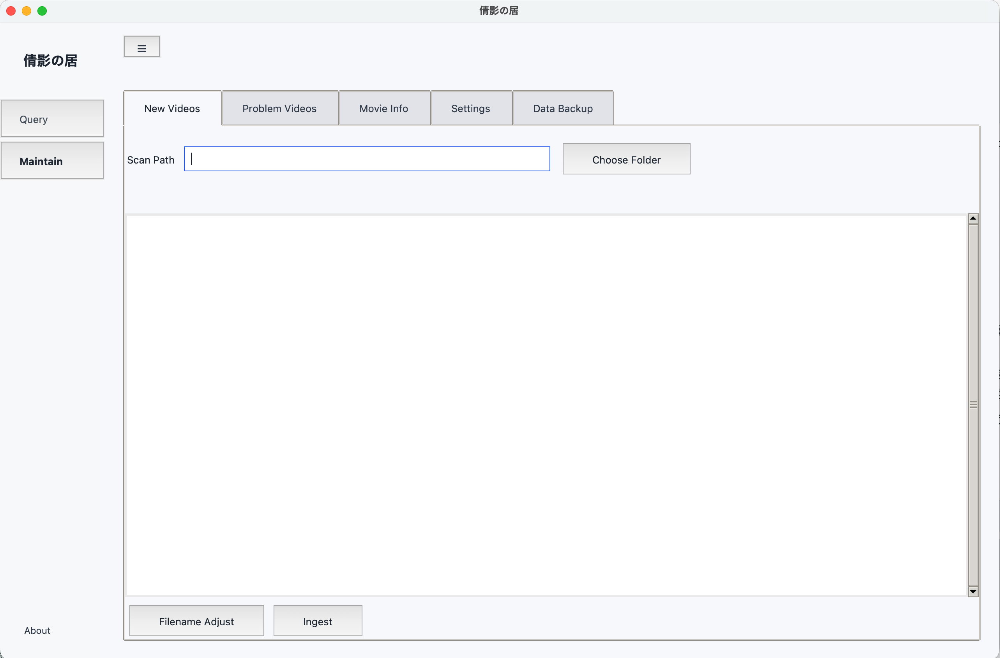
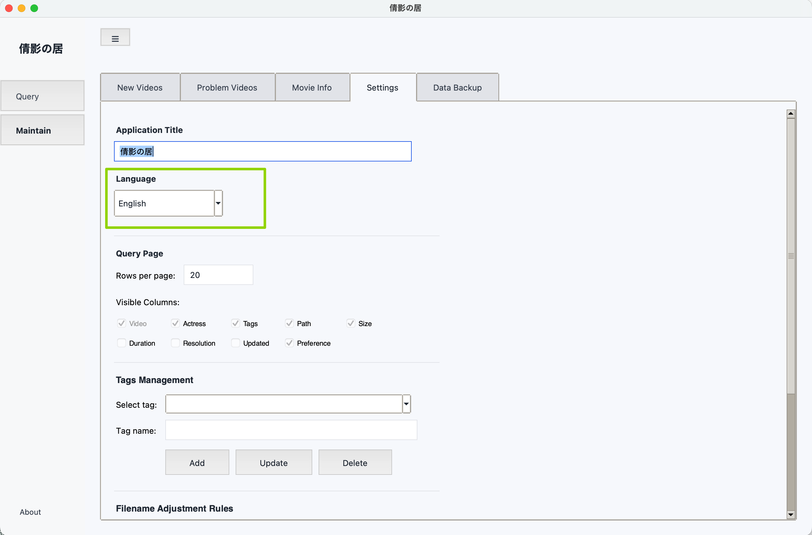

# XJJ Housekeeper (Version 1.0.0, 倩影の居)

English | [日本語](README.ja_JP.md) | [ไทย](README.th_TH.md) | [繁體中文](README.zh_TW.md) | [简体中文](README.md)

A desktop app for managing a local collection of code-based videos. It builds a searchable local index for files scattered across multiple drives and deep folders, helping you avoid duplicate downloads and quickly locate the real file path (even when some videos are on an unmounted external drive).

## Problems It Solves

- Too many downloads, too many drives, too many nested folders
- Messy filenames (prefix/suffix/watermarks), easy to download the same title again
- External drives are frequently mounted/unmounted, but you still need to know what you have and where it is
- You want tags, preferences, search, and playback from one place

## Why a Local Index

- Fully offline: metadata and preferences are stored on your computer
- Drive-friendly: you can still find the last known location even if the drive is not mounted
- Anti-duplicate: the same title can be recognized as “already exists” even if the filename changes
- Fast search: fuzzy search by video code, actress, or tags

## Who This Is For

- People with a large local library distributed across multiple drives/folders
- Anyone who prefers an offline database index over an online service
- Users who can prepare their own movie-info dataset (import supported; scraping not provided by default)

## Key Features

### 1) Search & Browse (Query)

- Fuzzy search by video code / actress name / tags
- Paged, sortable table with configurable visible columns
- Double-click actions:
  - Double-click the path to reveal it in file manager
  - Double-click other columns to play the video (default or selected player)
- Preferences: like / dislike / deleted

### 2) Library Maintenance (Maintain)

- Scan & ingest: ingest a single folder or a parent folder (including subfolders)
- Folder cleanup: normalize filenames to `ABC-123.mp4` style (configurable rules)
- Smart merge: you can scan the same folder multiple times
  - New files are added into the index
  - Moved files are recognized and their paths are updated (no “duplicate re-ingest”)
  - Re-scan after mounting a drive to refresh its latest status

### 3) Problem Finder (No Direct File Deletion)

- Broken/abnormal videos: list potentially unplayable videos
- Duplicates: list duplicated records under the same video code
- Important: “Delete” only removes/marks database records, it does not delete your actual video files; delete files yourself in file manager

### 4) Movie Info (Actress / Release Date / Title)

- Purpose: enrich a video code with actress ownership and release date for better search and stats
- Compliance: to reduce legal risk, scraping is not provided; import your own prepared dataset
- Import/Export format: UTF-8 text (BOM allowed), `|` separated, with a fixed header:

```
actress_name|video_code|release_date|title
```

Example:

```
actress_name|video_code|release_date|title
Sample Actress|ABC-123|2024-01-02|Sample Title
Sample Actress|DEF-456||optional
```

### 5) Settings & Backup

- Settings:
  - App title
  - UI language (switch inside the app)
  - Page size and visible columns
  - Tag management
  - Rename-rule management (for filename cleanup)
- Backup:
  - Export a single JSON backup file (database + settings + rename rules)
  - Import to restore
  - Initialize (reset and rebuild data/config)

## Supported Formats & Filters

- Supported video extensions: `.mp4 .mkv .mov`
- Ingest skips tiny files (smaller than 10KB)
- Filename normalization only processes `.mp4/.mkv/.mov` and skips files smaller than 100MB by default (configurable)

## UI Screenshots (Sample Data)

These screenshots use sample data to demonstrate the UI and workflows, and do not contain any real video information.

### Query: Search, double-click play/reveal, preferences



### Maintain: Scan ingest and smart merge by re-scanning



### Settings: Language switch



## Quick Start (Desktop)

### Option A: Run from source (recommended for customization)

Requirements:

- Python 3.10+
- Poetry
- Recommended: FFmpeg (`ffprobe`) for extracting duration/resolution/codec

Install dependencies (project root):

```bash
poetry install
```

Launch:

- macOS: double-click `startup/XJJ-Desktop.command`
- Windows: double-click `startup/XJJ-Desktop.bat`
- Or run:

```bash
python -m ui.tkinter.app
```

Suggested first-time flow:

1. Open Settings/Backup and click “Initialize”
2. Go to Maintain and scan your video root folder
3. Go to Query and search by code/actress/tags, then double-click to play or reveal

Default data locations:

- Running from source: under `output/` relative to the project root
  - Database: `output/video_info_collector/database/video_database.db`
  - UI settings: `output/video_info_collector/settings.json`
  - Rename rules: `output/video_info_collector/conf/rename_rules.yaml`
- Packaged app: stored in your user data directory (so upgrades/uninstalls won’t lose data)
  - macOS: `~/Library/Application Support/倩影の居/output/...`
  - Windows: `%APPDATA%\\倩影の居\\output\\...`

## Usage Guide (Scenario-Based)

This section focuses on real workflows (what you want to achieve), not just listing features.

### 0) Before You Start: Prepare Two Folders

- Your long-term library folder (“main library”): can be multi-drive/multi-folder; organize by your preference.
- A temporary staging folder (“inbox”): put newly downloaded and messy files here, normalize and verify first, then move into the main library.

This makes filename cleanup safer (no risk to your main library structure) and keeps indexed paths more stable.

### 1) Query: “I want to find a code/tag/actress quickly”

Goal: stop digging through folders; jump to the real file path.

- In the Query page, type a keyword:
  - A video code (recommended): `ABC-123`
  - A tag: `Action`, `2024`, `Office`
  - An actress name: works best after you import movie info
- After results show up:
  - Double-click the path column: reveal in file manager
  - Double-click other columns: play with your default/selected player
- If the file is on an external drive that is not mounted:
  - You can still find the last known path
  - Play/reveal will fail until you mount the drive
- Suggested preference usage:
  - `like / dislike`: preference labels for filtering
  - `deleted`: treat as removed in the database/statistics (does not delete the actual file)

### 2) Maintain: Ingest videos, and re-scan safely

Goal: build a searchable local index across drives; keep paths updated when you move files.

#### Scenario A: You already have a categorized multi-level folder structure with clean filenames

Example:

- `/Volumes/Disk-1/folder/Action/ABC-123.mp4`
- `/Volumes/Disk-1/folder/Drama/DEF-456.mp4`
- `/Volumes/Disk-1/folder/Drama/2024/XYZ-999.mp4`

Recommended:

1. In Maintain, pick the top-level folder you want to ingest (e.g. `/Volumes/Disk-1/folder`), then start scan/ingest.
2. After the scan, the app auto-tags videos by folder structure:
   - Uses the first-level subfolder name as the tag (e.g. `Action`, `Drama`)
   - If you scan a leaf folder (videos are directly under it), uses that folder name as the tag
3. Note: these auto-generated tags are attached to video records (searchable), but they are not automatically added into your own “tag list” in Settings.

#### Scenario B: New downloads have messy filenames — clean first, then ingest (recommended)

Examples:

- `example.com_abc-123_1080p.mp4`
- `[watermark]ABC-123(uncensored).mp4`

Workflow:

1. Put new downloads into your temporary staging folder.
2. Run filename normalization in the staging folder, and verify results (to avoid mis-renaming):
   - CLI: `python -m tools.filename_formatter <staging-folder>`
3. Move the cleaned files into your main library folder (your preferred categories).
4. Scan/ingest the main library folder in Maintain.

#### Re-scan & moving files

- You can re-scan the same folder repeatedly: new files are added; moved files are detected and their paths updated.
- “missing” is scoped to the current scan root: scanning one drive/folder won’t mark unrelated folders as missing.

### 3) Problem Videos: Find issues without deleting your files

Goal: surface problems and let you decide; avoid accidental deletions.

- Broken/abnormal:
  - Usually means missing metadata (e.g. duration), caused by missing `ffprobe` or a corrupted file
  - Install FFmpeg (includes `ffprobe`) and re-scan that folder
- Duplicates:
  - When the same `video_code` appears in multiple records
  - Compare file size/resolution/bitrate and keep the one you want
  - You can delete database records or mark `deleted`; actual disk cleanup is done in file manager

### 4) Movie Info Import: Add actress/release/title for better search and stats

Goal: enrich your offline index with actress ownership and release/title metadata.

Recommended (Desktop UI):

1. Go to Maintain → Movie Info, click Import.
2. Import a UTF-8 text file (BOM allowed) with the fixed header:

```
actress_name|video_code|release_date|title
```

3. After import, searching actress names on the Query page can match records (as long as video codes match).

### 5) Database Files: Backup/migrate, multi-drive usage, and “readonly” pitfalls

Goal: keep your index portable and your data safe.

- Best practice: keep the database on a writable local path; the database can still reference video files on external drives.
- If you put the database on a readonly mount, ingest/update will fail with `attempt to write a readonly database`.
  - Move the database back to a writable local folder and continue.
- For migration/backup:
  - Use Settings/Backup to export one JSON backup (database + settings + rename rules), then import on another machine.
  - If you only copy the database file, also copy UI settings and rename rules for a consistent experience.

### Option B: Package and run from dist (offline distribution)

This project uses PyInstaller:

- macOS package: double-click `startup/Build-XJJ-Desktop-App.command`
- Windows package: double-click `startup/Build-XJJ-Desktop-App.bat`
- To bundle ffmpeg/ffprobe:
  - macOS: `startup/Build-XJJ-Desktop-App-With-FFmpeg.command`
  - Windows: `startup/Build-XJJ-Desktop-App-With-FFmpeg.bat`

Artifacts are under `dist/`.

## Advanced: CLI Tools (Optional)

The desktop app reuses the same database and capabilities as these CLIs:

- Filename normalization: `python -m tools.filename_formatter <folder>`
- Video ingest/collector: `python -m tools.video_info_collector /path/to/videos`

More details:

- `tools/filename_formatter/README.md`
- `tools/video_info_collector/README.md`

## OS Support & External Dependencies

Operating systems:

- macOS (recommended)
- Windows (recommended)
- Linux: should work if Tk is available, not a primary target

External dependencies:

- FFmpeg / ffprobe: for video metadata extraction (recommended or bundle during packaging)
- File-reveal and playback rely on OS-provided commands

## README Languages

This repository maintains multiple README files:

- Simplified Chinese: `README.md`
- English: `README.en_US.md`
- Japanese: `README.ja_JP.md`
- Thai: `README.th_TH.md`
- Traditional Chinese: `README.zh_TW.md`
