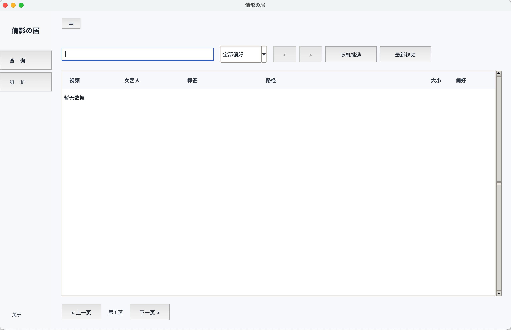
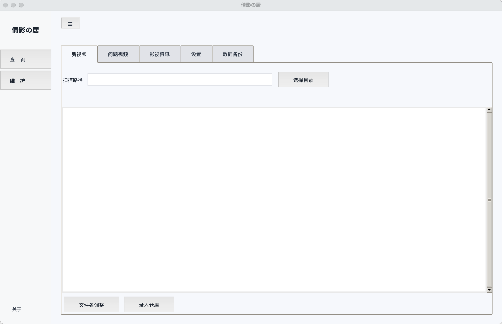
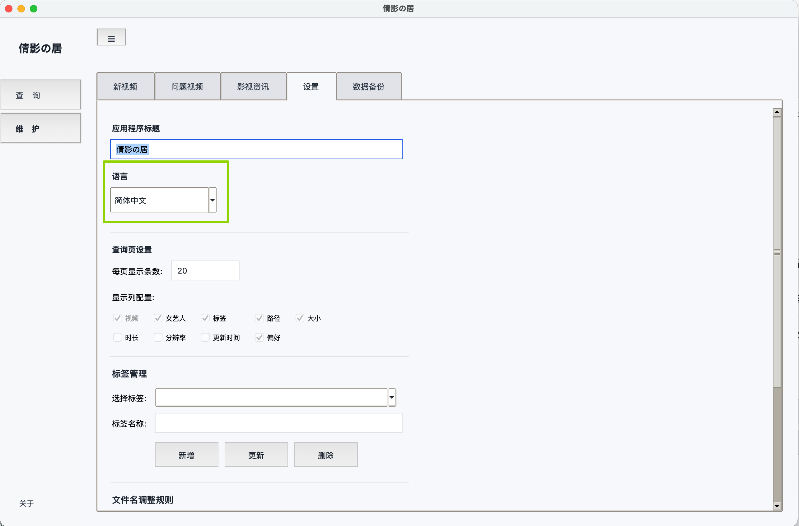

# XJJ Housekeeper（Version 1.0.0 倩影の居）

[English](README.en_US.md) | [日本語](README.ja_JP.md) | [ไทย](README.th_TH.md) | [繁體中文](README.zh_TW.md) | 简体中文

面向“本地番号视频库”的桌面管理工具：把散落在多个硬盘、多个目录、命名不统一的视频文件，整理成可检索的本地索引，帮助你避免重复下载，并能快速定位到文件真实位置（即使某些视频在未挂载的移动硬盘上）。

## 解决以下问题

- 下载多、盘多、目录深，想找某个番号时只能靠记忆翻目录
- 文件名不规范（大小写/前缀/后缀/网站水印），同一作品容易被重复下载
- 移动硬盘经常拔插，视频暂时不可访问，但你仍需要知道“我有/没有”与“在哪个盘”
- 需要给视频打标签、做喜好标记，并在一个界面里检索与播放

## 为什么选择“本地索引”

- 数据完全离线：所有元数据与偏好信息保存在你的电脑，无需联网，也不依赖任何在线服务
- 盘位友好：即使硬盘未挂载，你仍能知道“我有这部作品”并定位到盘符/路径
- 重复下载克星：同一作品无论文件名如何变化，都能被识别为“已存在”，避免再次下载
- 一键检索：支持按番号、女艺人、标签等多字段模糊搜索，秒级返回结果

## 适用人群

- 拥有大量本地番号视频文件，且视频分布在多块硬盘/多层目录
- 希望用“本地数据库索引”管理，而不是依赖在线服务
- 可以自行维护影视资讯数据来源（本项目提供导入能力，不提供爬取功能）

## 主要功能

### 1) 检索与浏览（查询页）

- 模糊搜索：支持按 视频号（番号）/ 女艺人名字 / 标签 进行检索
- 结果表格：分页、排序、可配置可见列
- 双击操作：
  - 双击路径：打开文件管理器定位文件
  - 双击其它列：用系统默认播放器或指定播放器播放视频
- 喜好标记：like / dislike / deleted

### 2) 本地视频维护（维护页）

- 扫描并录入：支持对“单一目录”或“父级目录（含子目录）”批量录入
- 复杂目录清洗：重命名/规范化为 `ABC-123.mp4` 形式（可配置多条替换规则）
- 智能合并机制：同一个目录可以重复扫描多次
  - 新增文件会被补充进数据库
  - 已收录文件如果移动了位置，再次扫描时会自动识别并更新路径（避免因为搬家就“重复入库”）
  - 连接硬盘后重新扫描即可刷新当前盘的最新状态

### 3) 问题视频发现（但不直接删除文件）

- 破损/异常视频：把可能无法播放的视频清单一键列出
- 重复视频：同一视频号（番号）在库中存在多条视频记录时可一键列出
- 重要说明：本应用的“删除”仅删除数据库记录/标记，不会直接删除你的磁盘视频文件；需要你自行在文件管理器中删除文件

### 4) 影视资讯（女艺人归属、发布日期、标题）

- 目标：为某个番号补充“属于哪位女艺人的作品”“发布时间（release_date）”“标题”等信息，便于检索与统计
- 合规策略：为避免法律风险，本项目不提供资讯爬取功能；推荐你自行从可信来源整理数据后导入
- 支持导入/导出文件格式：UTF-8（可带 BOM）的文本文件，使用 `|` 分隔，表头固定为：

```
actress_name|video_code|release_date|title
```

示例：

```
actress_name|video_code|release_date|title
示例艺人|ABC-123|2024-01-02|示例标题
示例艺人|DEF-456||（可留空）
```

### 5) 设置与备份

- 设置：
  - 应用标题
  - UI 语言（应用内可切换）
  - 查询分页大小、可见列
  - 标签管理（便于检索查询）
  - 重命名规则管理（用于“目录清洗/重命名”）
- 数据备份：
  - 导出为单一 JSON 备份文件（包含数据库、设置与重命名规则）
  - 从备份文件导入恢复
  - 初始化（清空并重建数据与配置）

## 支持的视频格式与过滤规则

- 当前支持的视频扩展名：`.mp4 .mkv .mov`
- 录入时会自动跳过极小文件（小于 10KB，通常是无效碎片/元数据文件）
- 文件名规范化工具（重命名）默认只处理 `.mp4/.mkv/.mov`，且默认跳过小于 100MB 的文件（可在规则配置中调整）

## 快速开始（桌面端）

### 方式 A：从源码运行（推荐开发/自定义）

环境要求：

- Python 3.10+
- Poetry
- 推荐安装 FFmpeg（需要 `ffprobe` 用于提取时长/分辨率等元数据）

安装依赖（项目根目录）：

```bash
poetry install
```

启动：

- macOS：双击 `startup/XJJ-Desktop.command`
- Windows：双击 `startup/XJJ-Desktop.bat`
- 或直接运行：

```bash
python -m ui.tkinter.app
```

首次使用建议流程：

1. 打开应用后先进入“设置/备份”，点击“初始化”（会创建数据库与配置文件）
2. 进入“维护”，选择你的视频根目录并执行“录入/扫描”
3. 回到“查询”，用番号/艺人/标签进行模糊搜索，双击播放或定位文件

数据默认位置：

- 从源码运行：相对项目根目录的 `output/` 下
  - 数据库：`output/video_info_collector/database/video_database.db`
  - UI 设置：`output/video_info_collector/settings.json`
  - 重命名规则：`output/video_info_collector/conf/rename_rules.yaml`
- 打包运行：会落到你的用户数据目录（便于升级/卸载不丢数据）
  - macOS：`~/Library/Application Support/倩影の居/output/...`
  - Windows：`%APPDATA%\\倩影の居\\output\\...`

## 使用指南（按场景）

### 0) 开始前：建议先准备两类目录

- 视频长期存放目录（你的“正式库”）：多盘、多目录都可以，结构按你习惯来（按年份/类型/女优/系列等）。
- 临时处理目录（你的“收件箱/中转站”）：专门用来接收新下载、乱命名、带水印前后缀的文件；清洗确认无误后再搬到正式库。

这样做的好处是：重命名/清洗更安全（不影响正式库结构），同时数据库里记录的路径也更稳定。

### 1) 查询：我想快速找到某个番号/标签/女优

目标：不靠记忆翻目录，直接定位到真实文件路径。

- 打开“查询”页，在搜索框输入关键词：
  - 输入番号：如 `ABC-123`（推荐）
  - 输入标签：如 `动作`、`2024`、`办公室`
  - 输入女优名：导入过影视资讯时可用
- 结果出来后：
  - 双击“路径”列：打开文件管理器并定位到文件
  - 双击其它列：用默认播放器（或你设置的播放器）播放
- 如果视频在外接硬盘里、当前没挂载：
  - 仍然可以查到“我有这部作品”以及它原本在哪个盘/目录
  - 但此时播放/定位会因为文件不可访问而失败；把硬盘接上后再试即可
- 喜好标记建议用法：
  - `like / dislike`：纯偏好标记，便于筛选
  - `deleted`：表示你希望“把它当作已删除/不再需要”（只影响数据库与统计，不会删除磁盘文件）

### 2) 维护数据：把视频录入仓库，并能反复扫描不乱

目标：把“散落在多个盘”的视频变成可检索的本地索引；后续移动文件也能自动更新路径。

#### 场景 A：你已经按类目整理成多级目录，且文件名基本符合番号格式

例如：

- `/Volumes/Disk-1/folder/动作/ABC-123.mp4`
- `/Volumes/Disk-1/folder/剧情/DEF-456.mp4`
- `/Volumes/Disk-1/folder/剧情/2024/XYZ-999.mp4`

推荐做法：

1. 进入“维护”，选择你要导入的“顶层目录”（例如 `/Volumes/Disk-1/folder`），点击“录入/扫描”。
2. 扫描完成后会自动给视频打标签：
   - 以“首层子目录名”作为标签（如 `动作`、`剧情`）
   - 如果你直接扫描某个子目录（目录下直接放视频），则使用该目录名作为标签
3. 注意：这些“自动标签”会写入视频记录（用于查询搜索），但不会自动加入你在“设置”里维护的“标签清单”。

#### 场景 B：新下载文件名很乱，想先清洗再入库（强烈推荐）

典型文件名：

- `example.com_abc-123_1080p.mp4`
- `【水印】ABC-123(uncensored).mp4`

推荐流程（更安全，且路径更稳定）：

1. 把新下载的视频先放到“临时处理目录”。
2. 在临时处理目录里执行“文件名规范化/重命名清理”，把文件统一成 `ABC-123.mp4` 形式，并确认没有误判/误改。
   - UI路径：维护 => 新视频 => 点击'选择目录' => 选中<临时目录> => 点击'文件名调整' 按钮
   - 命令行可用：`python -m tools.filename_formatter <临时目录>`  
3. 确认无误后，把清洗好的文件移动到你的“正式库目录”（按你的类目归档）。
4. 最后在“维护”里扫描“正式库目录”完成入库。

#### 反复扫描与搬家

- 同一个目录可以反复扫描：新增会补进数据库；已收录文件被移动到新位置时，再次扫描会自动识别并更新路径。
- 当你扫描的某块盘/某个根目录，之前存在的视频（基于番号和文件大小进行唯一性判断）不存在了，那么内部会标记该记录为 'missing'，且不会再被搜索到。这种情况一般发生在你自行在文件夹中删除掉了一些视频后再次扫描该目录时出现，是正常现象。

### 3) 问题视频处理：找出异常/重复，但不直接删你的文件

目标：让你“发现问题并做决策”，避免程序替你误删。

- 破损/异常视频：
  - 通常表现为“无法提取时长/分辨率”等元数据（例如未安装 `ffprobe`、或文件本身损坏）
  - 建议：先确保系统安装了 FFmpeg（包含 `ffprobe`），再对该目录重新扫描
- 重复视频：
  - 同一 `video_code` 在库中出现多条记录时会被识别为重复
  - 建议：先按文件大小/分辨率/码率等对比，决定保留哪一份
  - 你可以删除“数据库记录”或打 `deleted` 偏好标记，出于安全设计考量，本程序不会删除任何磁盘文件；磁盘清理由你在文件管理器中自行手动完成

### 4) 影视资讯如何导入：补齐女优/发布日期/标题，便于检索统计

目标：在离线索引基础上，补充“女优归属、发布日期、标题”等字段。

推荐做法（桌面端）：

1. 打开“维护”页中的“影视资讯”区域，点击“导入”。
2. 导入文件格式为 UTF-8（可带 BOM）的文本文件，表头必须为：

```
actress_name|video_code|release_date|title
```

示例：

```
actress_name|video_code|release_date|title
示例艺人|ABC-123|2024-01-02|示例标题
示例艺人|DEF-456||（可留空）
```

标题可以留空，本应用目前不会显示视频标题。

3. 导入后，在“查询”页输入女优名也可以命中（前提是对应记录存在且 video_code 能匹配）。并且为了避免重复爬取，你也可以单独导出视频讯息数据单独存放。导入和导出文件是同格式，便于你日后再行导入。

### 5) 数据库文件如何处理：备份/迁移/多盘与只读盘注意事项

目标：既要“索引跨硬盘”，也要“数据安全可迁移”。

- 推荐做法：数据库文件放在本机可写的用户目录里；数据库记录的视频路径可以指向外接硬盘上的文件。
- 如果你把数据库放到只读卷/只读挂载的外接盘上，录入/更新会报错 `attempt to write a readonly database`。
  - 解决思路：把数据库放回本机可写目录，再继续维护；不要把数据库放在只读位置。
- 迁移/换电脑/做备份：
  - 使用“设置/备份”导出单一 JSON 备份文件（包含数据库、设置与重命名规则），在另一台机器导入即可恢复。
  - 如果你只拷贝数据库文件，别忘了同时处理 UI 设置与重命名规则（否则体验会不一致）。

### 方式 B：打包与运行 dist（离线分发）

本项目使用 PyInstaller 打包桌面应用：

- macOS 打包：双击 `startup/Build-XJJ-Desktop-App.command`
- Windows 打包：双击 `startup/Build-XJJ-Desktop-App.bat`
- 如需把 ffmpeg/ffprobe 一起打进包里：
  - macOS：双击 `startup/Build-XJJ-Desktop-App-With-FFmpeg.command`
  - Windows：双击 `startup/Build-XJJ-Desktop-App-With-FFmpeg.bat`

打包后产物位于 `dist/`。macOS 通常为 `dist/XJJ-Housekeeper.app`，Windows 通常为 `dist/XJJ-Housekeeper/`（或同名可执行文件）。

## 界面截图（示例数据）

以下截图为示例数据，用于说明界面与操作路径，不包含任何真实视频信息。

### 查询：模糊检索、双击播放/定位、喜好标记



### 维护：扫描录入与重复扫描的智能合并



### 设置：语言切换



## 进阶：命令行工具（可选）

项目同时提供两套可独立使用的 CLI 工具，桌面端也会复用其数据库与能力：

- 文件名规范化：`python -m tools.filename_formatter <目录路径>`
- 视频录入管理：`python -m tools.video_info_collector /path/to/videos`

更详细的参数与示例：

- `tools/filename_formatter/README.md`
- `tools/video_info_collector/README.md`

## 支持的操作系统与外部依赖

操作系统：

- macOS（推荐）
- Windows（推荐）
- Linux：理论上可运行（需系统具备 Tk 支持），未作为主要目标环境

外部依赖：

- FFmpeg / ffprobe：用于提取时长、分辨率、编码等视频元数据（强烈建议安装或在打包时一并包含）
- 其他诸如“打开文件管理器/调用默认播放器”等能力依赖操作系统自身提供的命令

## README 多语言

- README 顶部已提供多语言版本入口（English / 日本語 / ไทย / 繁體中文 / 简体中文）。
- 应用内 UI 也支持多语言切换，具体可在“设置”中选择。
